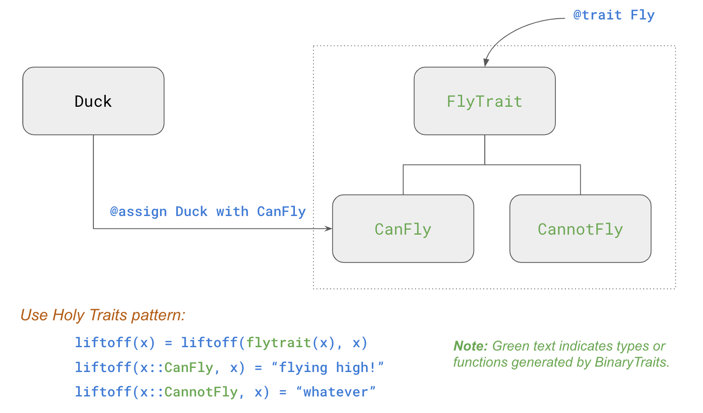
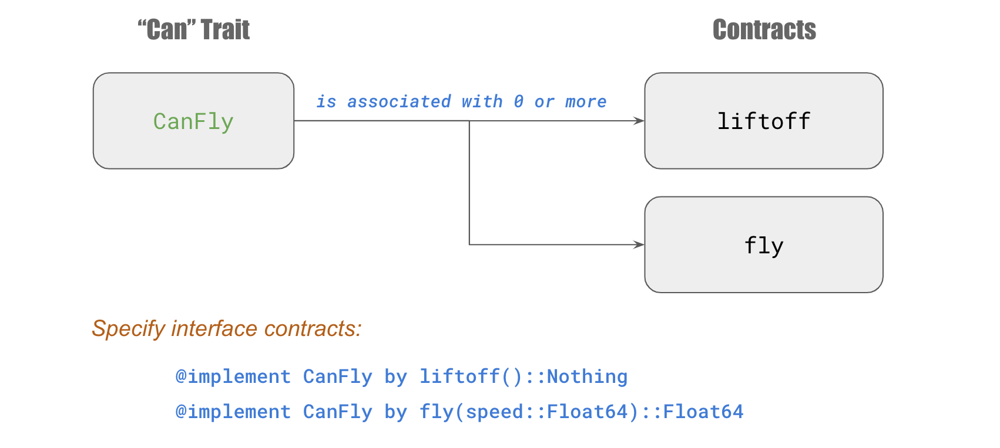

## Traits

Several data types are automatically declared when a trait is defined.
The parent type always has `Trait` append to the end of the trait's
name.  The subtypes include the so-called *Can-trait type* and
*Cannot-trait type*.  This is common type hierarchy structure
used by the Holy Traits pattern.

Let's look at an example:

## Interface Contracts

A trait can be associated with a set of interface contracts.  So any
data type that exhibits the trait should define those functions.

